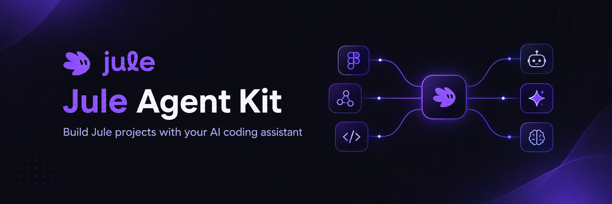

<p align="center">
  
</p>

Teach your AI coding assistant to build with [Jule](https://jule.ai): pop-ups, sign-up and
newsletter forms, quizzes and surveys, preference centers, unsubscribe pages and hosted landing
pages — from a brief or a Figma design — as Jule projects you preview and publish from your Jule
dashboard, not as HTML/CSS files.

The kit packages three things for every major assistant from one repository:

| | What it is |
|---|---|
| **MCP connection** | The Jule MCP server, `https://api.jule.ai/mcp`. Sign in with your Jule account in the browser; nothing to install on your side. |
| **Skills** | `skills/jule-builder` (build or change a project), `skills/figma-to-jule` (from a Figma design), `skills/jule-analytics` (read the numbers, recommend one change). Each carries the catalogs the server serves as `references/`. |
| **Rules and commands** | Always-on rule: in this workspace those things are built as Jule projects through the `jule` MCP, never as files unless you ask for a standalone site. Commands `/jule:popup`, `/jule:preference-center`, `/jule:landing`, `/jule:report`. |

Full per-client instructions, including Claude web and ChatGPT: https://docs.jule.ai/developers/mcp

## Install

### Claude Code

```
/plugin marketplace add tryjule/jule-agent-kit
/plugin install jule@jule-agent-kit
```

Then `/mcp` → **jule** → **Authenticate** (the browser opens Jule). The plugin adds the server, the
three skills, the four `/jule:*` commands and a session-start hook that loads the rule in `AGENTS.md`. Without the plugin, the server alone is
`claude mcp add --transport http jule https://api.jule.ai/mcp`.

### Codex (CLI and desktop app)

```bash
codex plugin marketplace add tryjule/jule-agent-kit
codex
```

Open `/plugins`, pick the Jule marketplace and install **Jule**; the plugin adds the server and the
skills, and Codex prompts you to sign in. Open `/hooks` and trust the one session-start hook (it
prints `AGENTS.md` into context). Without the plugin:
`codex mcp add jule --url https://api.jule.ai/mcp` then `codex mcp login jule`. Running Codex from
a checkout of this repo also works: it reads `AGENTS.md` and finds the skills under `.agents/skills`.

### Gemini CLI

```bash
gemini extensions install https://github.com/tryjule/jule-agent-kit
```

Adds the server (sign in when Gemini asks), loads `GEMINI.md` as always-on context and registers
the `/jule:*` commands. The skills ship with the extension.

### Cursor

[](cursor://anysphere.cursor-deeplink/mcp/install?name=jule&config=eyJ1cmwiOiJodHRwczovL2FwaS5qdWxlLmFpL21jcCJ9)

Then copy `.cursor/rules/jule.mdc` into your project's `.cursor/rules/` (or open Cursor in a
checkout of this repo). Cursor loads `skills/*/SKILL.md` from the workspace as well. The link is
`cursor://anysphere.cursor-deeplink/mcp/install?name=jule&config=<base64 of {"url":"https://api.jule.ai/mcp"}>`.

### VS Code (Copilot agent mode)

[](vscode:mcp/install?%7B%22name%22%3A%22jule%22%2C%22type%22%3A%22http%22%2C%22url%22%3A%22https%3A%2F%2Fapi.jule.ai%2Fmcp%22%7D)

Insiders: replace `vscode:` with `vscode-insiders:`. Or add to `.vscode/mcp.json`:

```json
{ "servers": { "jule": { "type": "http", "url": "https://api.jule.ai/mcp" } } }
```

VS Code reads `AGENTS.md` from the workspace root for the rule.

### Windsurf

Add the server under Settings → MCP (`{"mcpServers":{"jule":{"serverUrl":"https://api.jule.ai/mcp"}}}`)
and copy `.windsurf/rules/jule.md` into your project's `.windsurf/rules/`.

### Everything else (Cline, Kiro, Zed, OpenCode, Antigravity…)

Add the server URL in the client's MCP settings and drop `AGENTS.md` into the project. Clients that
only speak stdio: `npx mcp-remote https://api.jule.ai/mcp`.

## Commands

| Command | Does |
|---|---|
| `/jule:popup <brief>` | Pop-up (modal, inline, banner or bubble): draft, validate, save, preview |
| `/jule:preference-center <brief>` | Iterable preference center from the live channels and message types |
| `/jule:landing <brief or Figma URL>` | Landing page hosted by Jule — sections, SEO, lead form |
| `/jule:report <project> [period]` | Read-only analytics report ending in one grounded recommendation |

Every command previews and stops; publishing is a separate, confirmed step you ask for.


## Repository layout

```
skills/<name>/SKILL.md          Agent Skills (Claude, Codex, Cursor, Gemini) + references/
.agents/skills/                 Codex discovery (symlinks to skills/)
.claude-plugin/                 Claude Code plugin + marketplace manifests; .mcp.json is the server
.codex-plugin/                  Codex plugin manifest + mcp.json
gemini-extension.json, GEMINI.md, commands/jule/*.toml   Gemini CLI extension
commands/*.md                   Claude Code /jule:* commands
.cursor/rules/, .windsurf/rules/, AGENTS.md              editor rules (one body, generated copies)
hooks/claude-codex-hooks.json   SessionStart hook: prints AGENTS.md into context (Claude Code, Codex)
scripts/sync-references.mjs     regenerates references/, SKILL.md blocks and rule copies (maintainers)
```

## Maintainers

The catalogs under `skills/*/references/`, the blocks between `<!-- sync:… -->` markers in each
`SKILL.md`, and the generated rule copies (`GEMINI.md`, `.cursor/rules/jule.mdc`,
`.windsurf/rules/jule.md`) mirror the Jule server and `AGENTS.md`; do not edit them by hand.
Jule engineers refresh them with `scripts/sync-references.mjs` (`--check` exits 1 on drift or when
the three manifests disagree on `version`). Release: bump `version` in `.claude-plugin/plugin.json`,
`.codex-plugin/plugin.json` and `gemini-extension.json`, run the check, tag `vX.Y.Z`, push.

## License

MIT — see [LICENSE](LICENSE).
